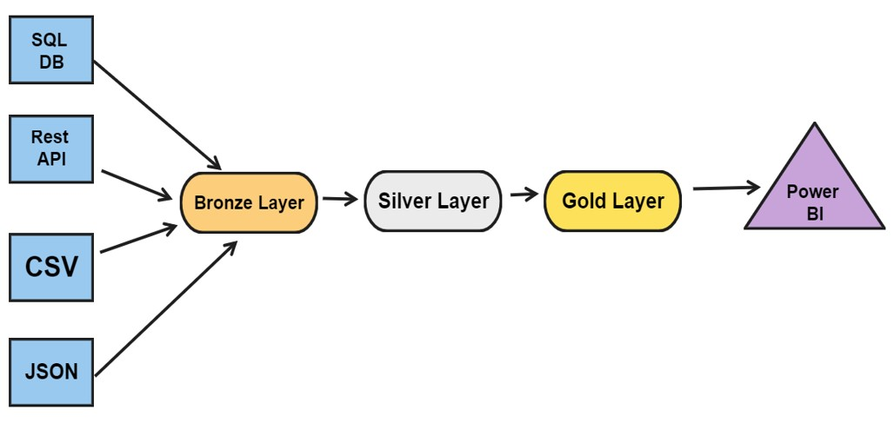
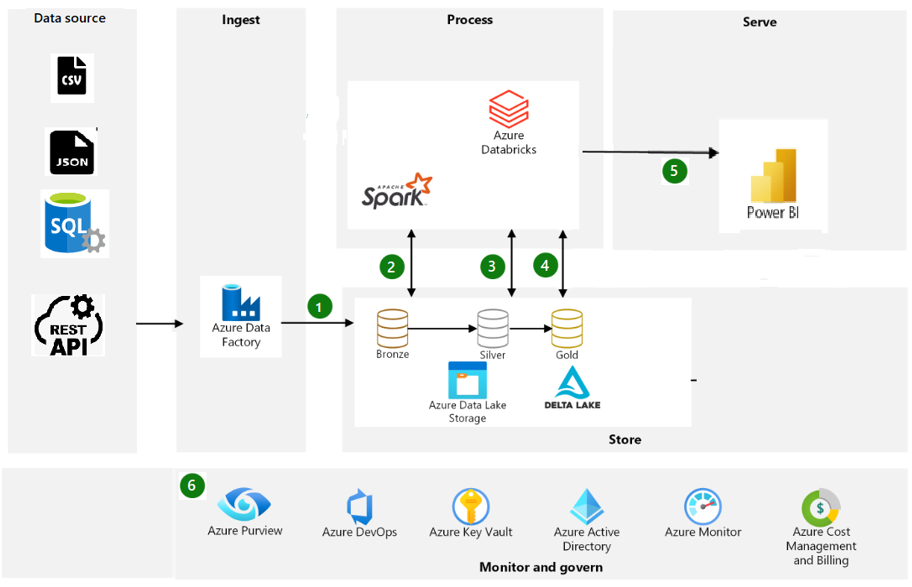

<h1 align="center">HealthCare_Insurance_Project</h1>  

<b>What is the project trying to solve?</b>

 

|    | Problem Statement                                                                                                                                                |
|----|------------------------------------------------------------------------------------------------------------------------------------------------------------------------|
| 1. | ABC is an insurance company that sells insurance policies to retail customers                                |
| 2. | In this project, I worked on developing an end-to-end data engineering pipeline for an insurance company to analyze claims data and perform customer segmentation|
| 3. | This will help the company to better understand their customers' needs and tailor their offerings accordingly|

 

<b>Tools</b>

 

|    | Technologies Used                                                                                                                                                      |
|----|------------------------------------------------------------------------------------------------------------------------------------------------------------------------|
| 1. | Azure Devops for following agile methodologies like sprint planning, sprint grooming, sprint retrospective, and task management |
| 2. | Azure Data Lake Storage for storage of extracted data like CSV, JSON, SQL|
| 3. | Azure SQLDB to use as an input data source|
| 4. | Azure Key Vault for password and secrets management|
| 5. | Azure Data Factory for data orchestration and building data extraction pipelines|
| 6. | Databricks for data processing using the medallion lakehouse architecture and data cleaning|
| 7. | Azure Devops GitHub for Version Control and CI/CD for Azure Data Factory pipelines and Databricks notebooks|

   

<b>High Level Details</b>

 

|    | High-Level Details                                                                                                                                |
|----|------------------------------------------------------------------------------------------------------------------------------------------------------------------------|
| 1. | These were the source systems: CSV Files, JSON Files, SQL Server DB|
| 2. | The Plan was to build the 3-layered (Bronze/Silver/Gold) architecture |
| 3. | Data had a lot of inconsistency and needed some cleaning |
| 4. | Once cleanup was done, multiple transformations were performed |
| 5. | Final layer i.e. the gold layer was stored as a Data lakehouse in Databricks|
| 6. | Gold layer data was accessed by PowerBI for visualization and reporting purposes|

 

<b>Additional Information</b>

 

|    | Additional Information                                                                                                                                             |
|----|------------------------------------------------------------------------------------------------------------------------------------------------------------------------|
| 1. | Branch data, Claim data, and Agent data were extracted from Azure SQL DB using Azure Data factory using the high watermark concept to load only the incremental data |
| 2. | Policy Data was sent once every day by an upstream system in an ADLS container in JSON format|
| 3. | Customer Information was sent once every day by the upstream system in an ADLS container in CSV format |
| 4. | The plan was to create 3 layered Data lake house architecture |
| 5. | Final data was used by PowerBI |
| 6. | Best practices were followed while designing solutions |

 

<b>Flow Diagram</b>

 
</img>  

    

<b>Architecture Diagram
</b>

 
</img>  

    

<b>Bronze Layer Loads Procedure</b>

 

|    | Steps followed for loading data in Bronze Layer                                                                                                                                            |
|----|------------------------------------------------------------------------------------------------------------------------------------------------------------------------|
| 1. |Agent data was extracted from Azure SQL DB using Azure Data Factory pipelines using the high watermark concept for incremental loads to avoid historical loads during every run and save time and were placed in landing/AgentData in ADLS|
| 2. |bronzelayer db was created in databricks|
| 3. |Then data was loaded from landing/AgentData to Agent table (delta table) bronzelayer.Agent in Databricks|
| 4. |Delta table was stored in bronzelayer/Agent in ADLS|
| 5. |Once the data was loaded in the table, the file was then moved into the processed/AgentData folder in ADLS|
| 6. |merge_flag = false column is added to the tables to track the loading of data in silver layer|  
| 7. |The same approach was followed for loading the other silver layer tables like policy, claim, customer, and agent|

 

<b>Silver Layer Loads Procedure</b>

 

|    | Steps followed for loading data in Silver Layer from Bronze Layer                                                                                                                                            |
|----|------------------------------------------------------------------------------------------------------------------------------------------------------------------------|
| 1. |silverlayer db was created in databricks|
| 2. |Delta table was created as silverlayer.Branch in ADLS in silverlayer/Branch path|
| 3. |merged_timestamp column was added in the silver layer branch table to track the time of merge of data from the bronze layer tables|
| 3. |Data was loaded from the bronzelayer.Branch into silverlayer.Branch|
| 4. |Only the data that is incremental and the data where merged_flag is false was pulled from bronze layer |
| 5. | Data that was pulled up having merged_flag=false was then applied with the cleanup/transformation rules and then merged into silverlayer/Branch table|
| 6. | Once the data was loaded in a silver layer in silverlayer.Branch. merge_flag=true was updated in the merge_flag column so that only the incremental data was loaded in silver layer tables and to avoid repetition of loads of the same historical data after every load which would cause delay of loads in silver layer from bronze layer | 

 

<b>Gold Layer Loads Procedure</b>

 

|    | Steps followed for loading data in Gold Layer from Silver Layer                                                                                                                                           |
|----|------------------------------------------------------------------------------------------------------------------------------------------------------------------------|
| 1. |goldlayer db was created in databricks|
| 2. |Temporary Views were created on silver layer tables using business logic, aggregations | 
| 3. |Once the temporary views were created using the business logic, aggregations of the views were fed to the PowerBI team to consume and create dashboards, which would in turn generate valuable insights into the entire business when presented to customers, and business stakeholders |

 

<b>Scheduling the Notebooks</b>

 

|    | Steps followed for Scheduling                                                                                                                                           |
|----|------------------------------------------------------------------------------------------------------------------------------------------------------------------------|
| 1. |Notebooks can be scheduled using data bricks workflows or can be scheduled using Azure Data Factory using triggers|
| 2. |Agent Data, Claim Data, and Branch Data ADF pipelines were scheduled to run once a day for loading incremental data using a high watermark concept from Azure SQL DB | 
| 3. | A single bronzelayer pipeline consisting of all the bronze layer notebooks was scheduled to run one after the other to move data from their landing to bronzelayer once a day after the Azure SQL DB extraction pipelines were finished |
| 4. | A single silverlayer pipeline consisting of all the silver layer notebooks was scheduled to run one after the other to move data from their bronzelayer to silverlayer once a day after the bronzelayer pipelines were finished|
| 5. |A single goldenlayer pipeline consisting of all the goldenlayer notebooks was scheduled to run one after the other to move data from their silverlayer to goldenlayer once a day after the silverlayer pipelines were finished|

 

  
  

